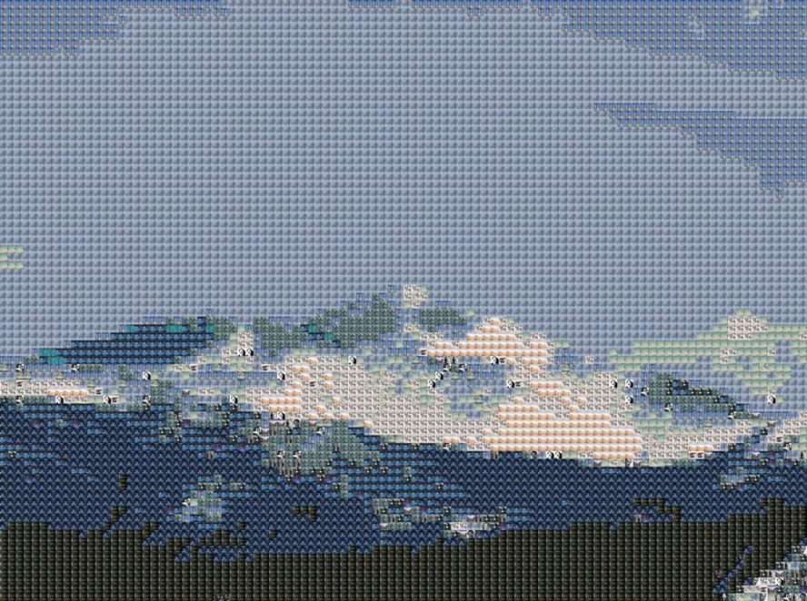

# Photomosaic
In doing research on this project, I ran across Sameep Tandon's ([Sameep Tandon on GitHub](https://github.com/sameeptandon)) photomosaic creator. It's one of the better photomosaic generators I've found.

##### Below is a photomosaic output from Sameep Tandon's photomosaic creator - mosaic.Sameep.py.
###### C:\Photomosaic>python mosaic.Sameep.py -i IMG_1025-resize.jpg -s dali-Flowers -r 5 5 -t 90 90 -a

A photomosaic of Long's Peak in Colorado, USA (Resized)

