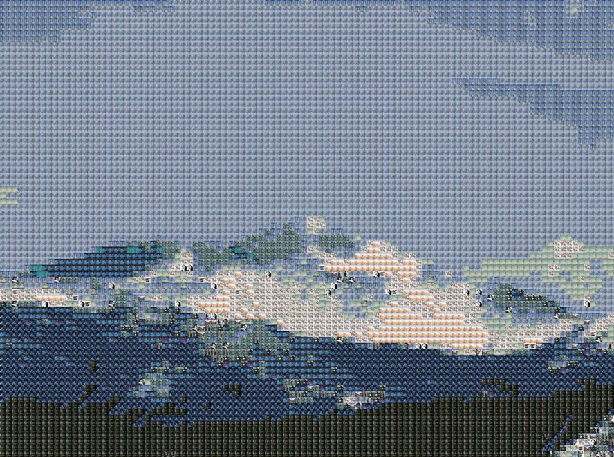

# CS1120 Photomosaic Assignment

This repository contains solutions and resources for the CS1120 Problem Set 1: Making Mosaics. The goal is to construct a photomosaic—an image composed of smaller images arranged to recreate the original picture.

- **Language:** Python
- **Working solution:** `photomosaic-2025-03.py`
- **Tile set:** Original assignment uses the `dali` directory of small photos as input. There are several other directories for tiling options available in the repo from other photomosaic experiments. 

## Assignment Instructions

Full details and requirements for the assignment are described in:

ps1/cs1120-Problem-Set-1-Making-Mosaics.html

If you want to make the effort to make it a viewable webpage:

Copy the entire contents of the HTML into a file named index.html (HTML may need to be refactored).

Save it anywhere on your computer.

Double-click it, or right-click and choose “Open with → Browser” (Chrome, Firefox, etc.).
That’ll render the webpage immediately.

## Quick Start

1. Ensure you have Python installed.
2. Place `photomosaic-2025-03.py` in your working directory.
3. Make sure the `dali` directory of tile images is present as required by the script.
4. Run the main file with:

    ```bash
    python photomosaic-2025-03.py
    ```

The script will assemble a photomosaic using the provided inputs.

## Collaboration & Submission

- See the assignment link above for detailed collaboration policy and submission instructions.

---

**Note:** If you need more information about the problem set, consult the HTML assignment file linked above.

---
# Photomosaic
In doing research on this project, I ran across Sameep Tandon's ([Sameep Tandon on GitHub](https://github.com/sameeptandon)) photomosaic creator. It's one of the better photomosaic generators I've found.

##### Below is a photomosaic output from Sameep Tandon's photomosaic creator - mosaic.Sameep.py.
###### ```C:\Photomosaic>python mosaic.Sameep.py -i IMG_1025-resize.jpg -s dali-Flowers -r 5 5 -t 90 90 -a```

A photomosaic of Long's Peak in Colorado, USA (Resized)

